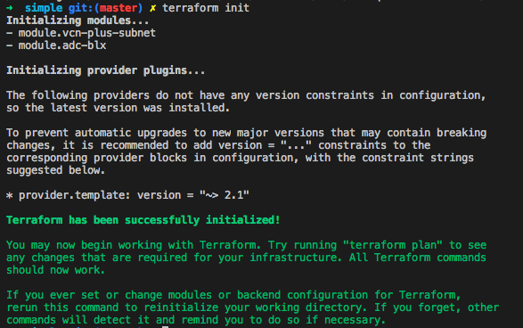
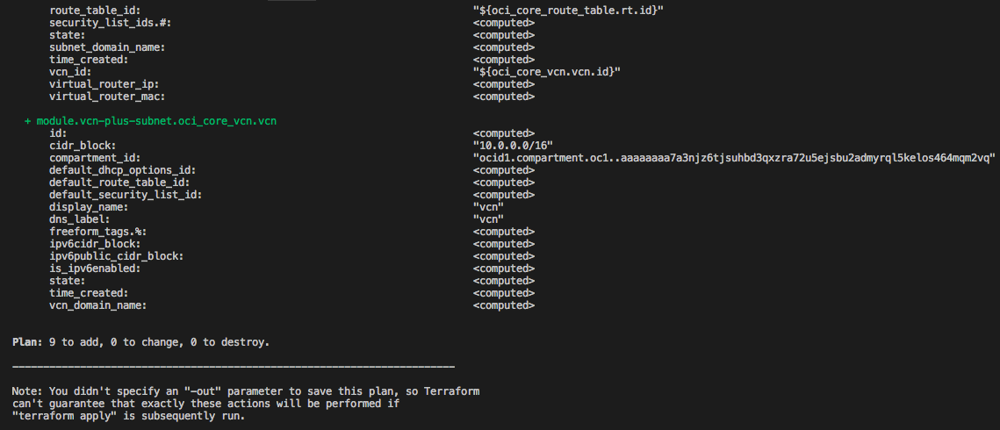
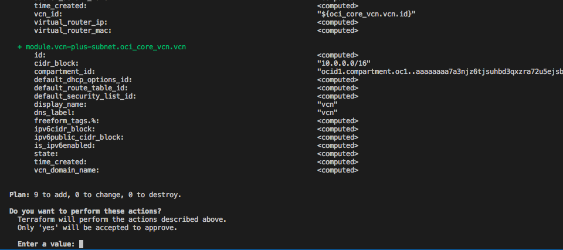

# Citrix ADC BLX
These are Terraform modules that deploys [Citrix ADC BLX apppliance](https://docs.citrix.com/en-us/citrix-adc-blx/13/introduction-blx.html) on [Oracle Cloud Infrastructure (OCI)](https://cloud.oracle.com/en_US/cloud-infrastructure).  They are developed jointly by Oracle and Citrix.

* [simple](simple) contains Terraform resources for deploying ADC-BLX on Oracle Cloud Infrastructure via Terraform CLI.
* [orm-generator](orm-generator) contains Terraform resources for packaging and deploying ADC-BLX on Oracle Cloud Infrastructure via OCI Resource Manager service.
* [marketplace](marketplace) contains Terraform resources for packaging and publishing ADC-BLX through the Oracle Cloud Infrastructure Marketplace service.
* [terraform-modules](terraform-modules) contains reusable Terraform modules

This repo is under active development.  Building open source software is a community effort.  We're excited to engage with the community building this.

## Prerequisites

First off we'll need to do some pre deploy setup.  That's all detailed [here](https://github.com/oracle/oci-quickstart-prerequisites).

Citrix ADC BLX appliances run as a software application, [supported](https://docs.citrix.com/en-us/citrix-adc-blx/13/supported-linux-platforms-adc-features-blx.html) on different Linux distributions.
We can run Citrix ADC BLX from a local Terraform CLI, OCI Resource Manager service or directly from the Marketplace Service on OCI.
When running ADC BLX from local Terraform CLI, customers are expected to download and store the tgz/RPM files on their own bucket on [OCI Object Storage](https://docs.cloud.oracle.com/iaas/Content/Object/Concepts/objectstorageoverview.htm). Take notes on bucket and object names as they will be used further.

## Clone the Module

Now, we'll want a local copy of this repo by running:

    git clone https://github.com/oracle/oci-quickstart-citrix.git

## Deploy Simple from Terraform CLI

The TF templates can be initialized by running the following commands:
```
cd oci-quickstart-citrix/adc-blx/simple
terraform init
```

This gives the following output:



Next, we should modify our template variables accordingly to our OCI Tenancy.
We can use the boilerplate available on [terraform.tfvars.template](terraform.tfvars.template) to setup the OCI provider variables. Rename the file to `terraform.tfvars` so that Terraform CLI can automatically pick it up as the default variables configuration.

We should also modify [variables.tf](./simple/variables.tf), updating at least the bucket and object names where ADC BLX RPM files (.tgz) were stored:

```
# ADC BLX stored on Object storage (requires bucket and object names)

variable "adc_blx_bucket_name" {
    default = "my-bucket"
}

variable "adc_blx_object_name" {
    default = "blx-13.0-36.27.tgz"
}

```

Now we should run a plan to make sure everything looks good:

```
terraform plan
```

That gives:




Finally, if everything is good, we can go ahead and apply:

```
terraform apply # will prompt to continue
```



The output of `terraform apply` should look like:


We now can connect via SSH or HTTPS through the public IP address of ADX-BLX Virtual Machine.
